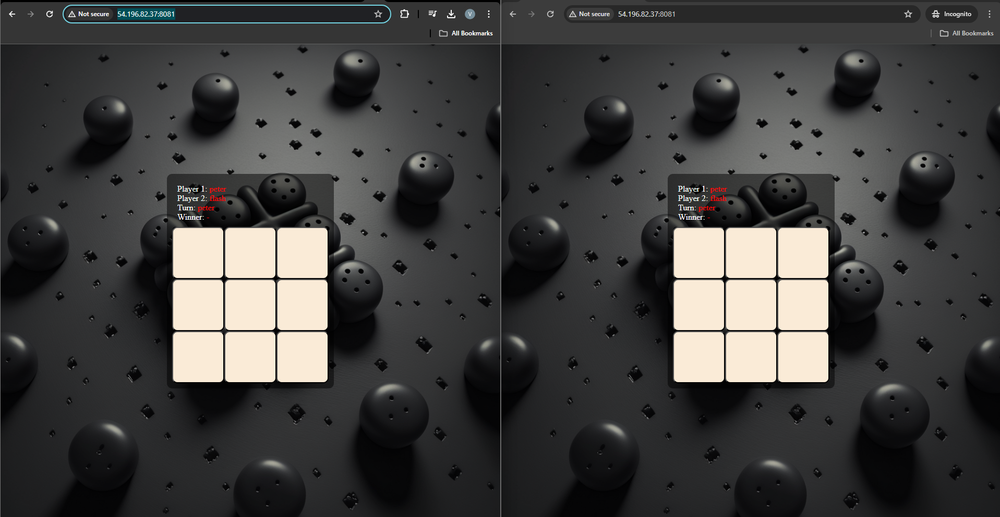
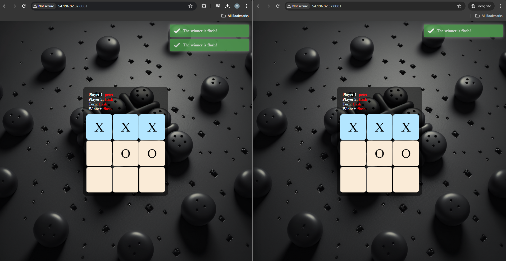
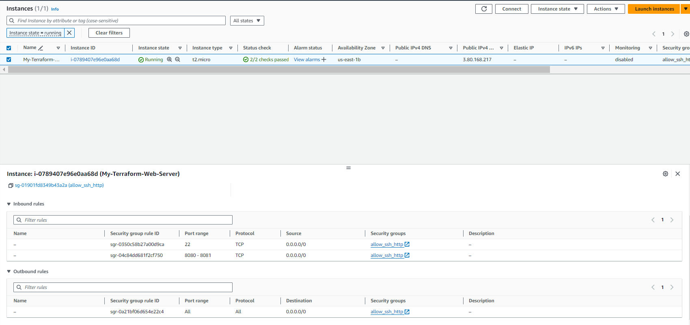
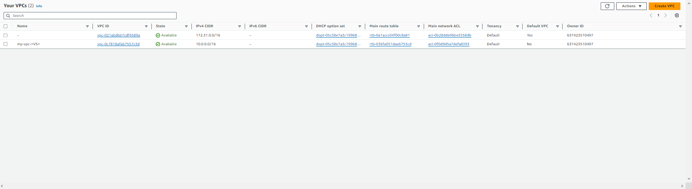

# Volodymyr Shepel - Terraform, EC2, TicTacToe report

- Course: *Cloud programming*
- Group: Volodymyr Shepel
- Date: 21.04.2024

## Environment architecture

The infrastructure consists of networking components, security groups, and an EC2 instance for hosting both the backend and frontend components of the application.

Components:

AWS VPC (Virtual Private Cloud): The VPC provides an isolated network environment for deploying the application components.
Subnets: A public subnet is created within the VPC to host the EC2 instance. This subnet allows inbound internet traffic and has a route to an internet gateway for external communication.
Internet Gateway (IGW): An internet gateway is attached to the VPC to enable communication between the VPC and the internet.
Route Table: A route table is associated with the VPC and contains a route to the internet gateway, allowing traffic destined for the internet to flow out of the VPC.
Security Groups: A security group is defined to control inbound and outbound traffic for the EC2 instance. SSH and HTTP traffic are allowed for management and application access.
EC2 Instance: An EC2 instance is provisioned to host both the backend and frontend components of the Tic Tac Toe application. It runs Ubuntu and has a public IP address for external access.

## Preview

Screenshots of configured AWS services. Screenshots of your application running.

## Reflections

- What did you learn?
- What obstacles did you overcome?
- What did you help most in overcoming obstacles?
- Was that something that surprised you?

In tackling this objective, I learned quite a bit about infrastructure as code (IaC) using Terraform, particularly in deploying EC2 instances and configuring networking components like VPCs and security groups. One significant obstacle I overcame was configuring the IP address of the backend when creating the frontend container. Initially, I encountered challenges in ensuring proper communication between the frontend and backend components of the TicTacToe game, especially in dynamically assigning the correct IP address for the backend within the frontend container.

While it took some trial and error to get it right, the process of problem-solving and experimenting with different approaches was quite enlightening.

I was surprised by how much Terraform streamlined the deployment process. Previously, starting containers and managing infrastructure was time-consuming and manual. With Terraform, defining infrastructure as code made deployment faster and more reliable, automating tasks like starting containers and configuring networkin