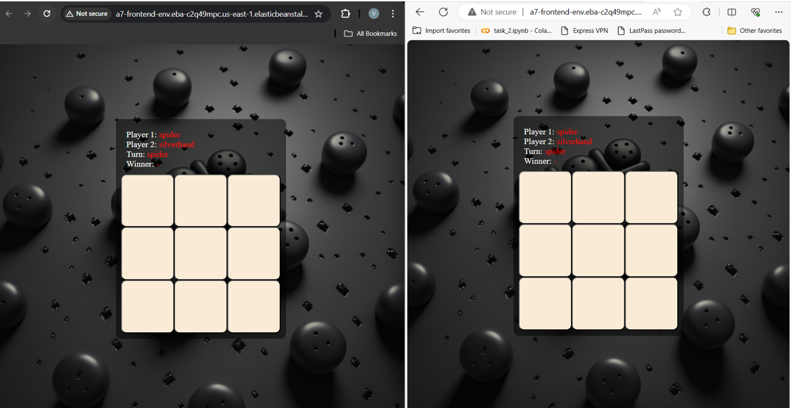

# Volodymyr Shepel - Beanstalk, Fargate report

- Course: *Cloud programming*
- Group:
- Date: 

## Environment architecture

Description and scheme of the developed infrastructure.

## Preview

Screenshots of configured AWS services. Screenshots of your application running.

## Reflections

- What did you learn?
- What obstacles did you overcome?
- What did you help most in overcoming obstacles?
- Was that something that surprised you?

## What I Learned
Throughout the cloud programming assignment utilizing Terraform, Beanstalk, and Fargate, I gained invaluable insights into modern cloud infrastructure management. One of the most significant learnings was the utilization of Terraform modules to enhance code organization and readability. Transitioning from a monolithic file structure to modularization greatly streamlined the development process and improved code maintainability.

Moreover, I delved into the intricacies of deploying applications on AWS Beanstalk and Fargate. Understanding the nuances of these services allowed me to leverage their functionalities effectively in deploying and managing containerized applications.

## Obstacles Overcome
One of the primary obstacles I encountered was attempting to manage the entire infrastructure within a single Terraform file. This approach led to code complexity and hindered comprehension. However, through exploration and experimentation, I discovered the power of Terraform modules, which enabled me to refactor the codebase into more manageable components.

Additionally, I encountered difficulties in passing the IP address of the backend into the frontend block of the configuration.

Another challenge arose from relying on sed commands within the frontend block to replace backend IP addresses. As the project progressed, this method became unwieldy and error-prone. Transitioning to utilizing environment variables provided a more robust and scalable solution, eliminating the need for manual intervention and ensuring consistency across deployments.

## Overcoming Obstacles
To overcome these challenges, I extensively utilized online resources, including documentation and forums. Engaging with the Terraform community and exploring best practices enabled me to refine my approach and adopt more efficient methodologies. Additionally, thorough research empowered me to make informed decisions regarding architecture design and implementation strategies, ultimately enhancing the quality of the solution.

Should admit that even though majority of problems were solved just by reading documentation and forums finding the correct information was really time consuming

## Surprising Discoveries
One aspect that surprised me was the versatility and ease of use of AWS Fargate for deploying containerized applications. Its seamless integration with ECS allowed for hassle-free management of containers without the need to provision or manage underlying infrastructure. This discovery highlighted the importance of staying updated with the latest cloud technologies and continuously exploring new tools to optimize workflows and enhance productivity.